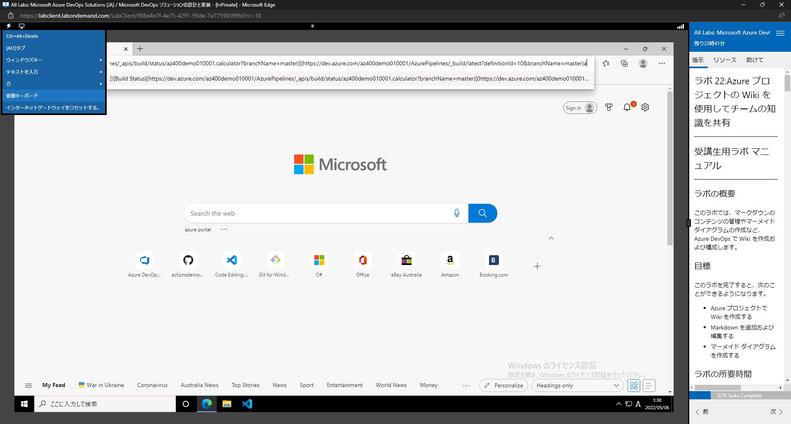
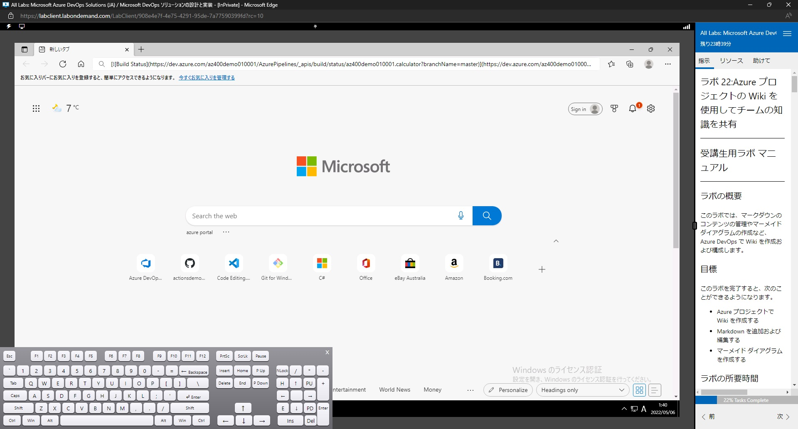
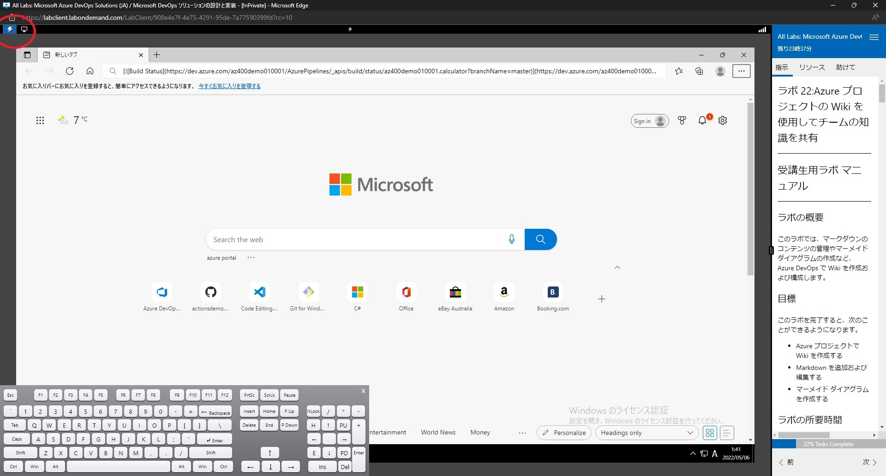
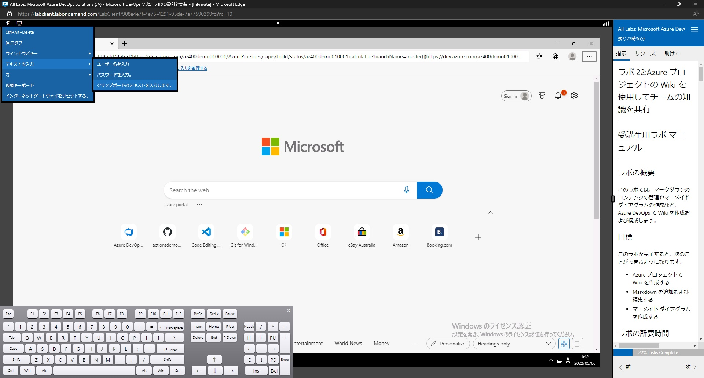
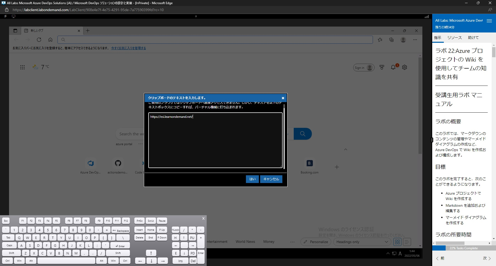
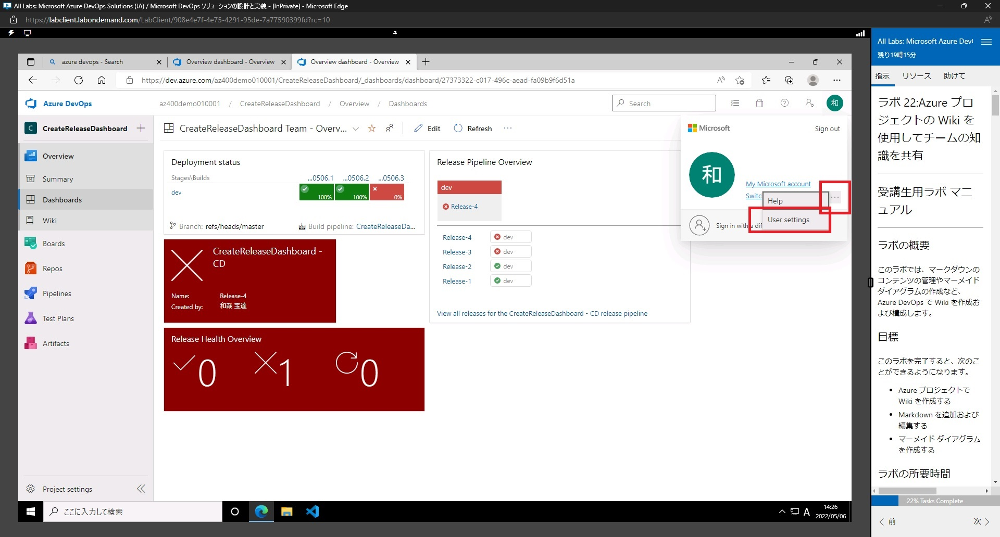
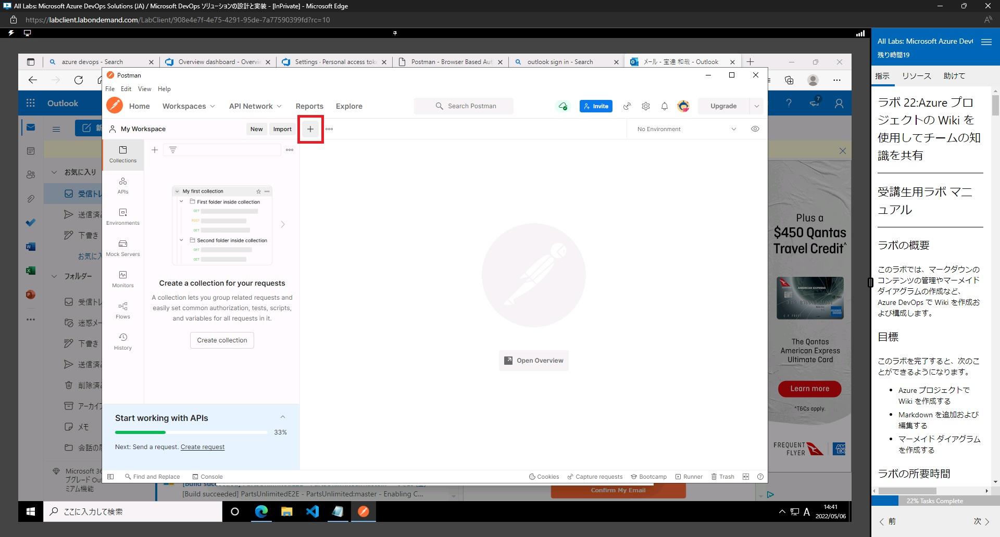
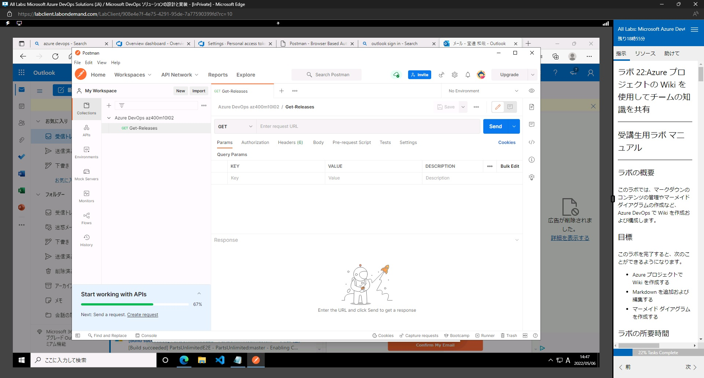
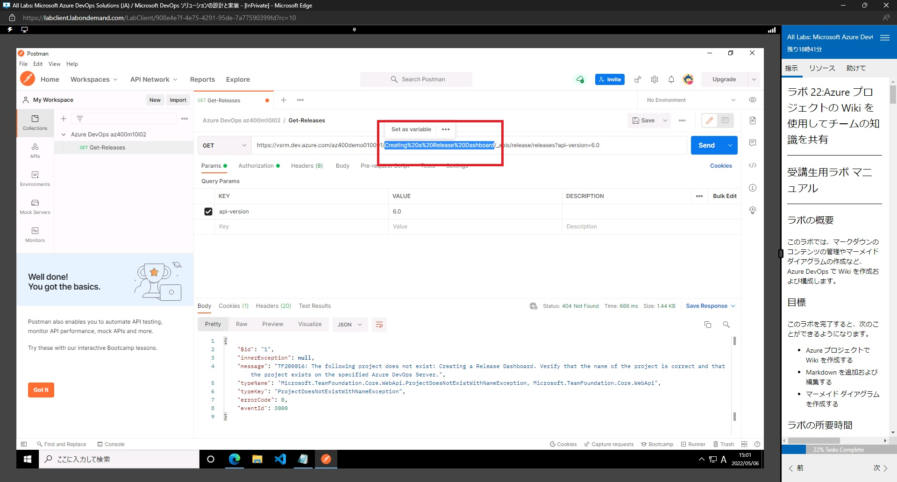

# ◆az-400
## ★リンク集 
* 今回のトレーニング用の新しいMicrosoftアカウントの作成:  
https://github.com/hiryamada/notes/blob/main/prep/msa.md
* ラボ利用にあたっての注意  
https://github.com/shu2-sato/courcenote/blob/main/az500/pdf/%E3%83%A9%E3%83%9C%E7%92%B0%E5%A2%83%E6%BA%96%E5%82%99.pdf  
※ラボを触るときは、ローカルの入力モードを、英字にしておくと安定します。
* ラボコンテンツ(最新)：  
[ラボコンテンツURL](./Lab_Apr_202204/AZ400_Top.md)  
* ラボ環境：  
https://esi.learnondemand.net
* Azure DevOps Demo Generator：  
https://azuredevopsdemogenerator.azurewebsites.net/
* Azure DevOps Portal  
https://dev.azure.com/
* ESI（Enterprise Skills Initiative)を用いた、無料の受講方法について:  
https://aka.ms/lxpexamdiscountvideo
* Courceware:  
https://aka.ms/MOC_AZ-400T00-jpn 

## ★前提条件  
* 本コースを受ける前提は以下のとおりです。  


## ★知識チェック
* 逐次URLを配布します。

## ★ラボHELP
---
* **ラボにおける知識習得の心構え**
  * ラボにおいては、実際に「どのような操作をするのか」と「何が行えるのか」の概観を理解してください。「何を使えばどんなことができるのか」という点を、機能と操作方法を交えて理解していくことで、座学だけの知識よりも、より一層理解が深まります。
---
* **<span style="color: red; ">ラボ用環境の注意</span>**  
  * 【重要】Lab内のIME入力モードと、Lab外のIME入力モード。   
    * Lab外のIME入力モードは、「半角英数字/直接入力」にしてください。Lab内のIME入力モードは、タスクバーに表示されている、IMEモードのアイコン（「A」や「あ」）をクリックして切り替えてください。（キーボードのショートカットで切り替えたりすると、Lab環境と利用端末間でキーボードが衝突して、不正な挙動になります）
  * 【重要】ラボの右側に、デモ用のガイドが出てきます。ですが、講義の進行順序と、ラボのガイドの内容・ラボの番号が一致していない可能性があります。原則的に、GithubのWebページとしてお伝えしている「ラボコンテンツ」を正としてください。ただし、一部ラボ内のコンテンツのほうが正しい場合があります。うまく進められない場合は適宜ご質問ください。
  * 前述の通り、ラボ内のガイドと、ラボ外のガイドで、ラボの番号が異なります。タイトルを見て判断してください。（Microsoftメンテナンスチームが常に更新を続けているため、更新が追い付かない場合があります。）
  * キーボードの配列がご利用いただいているキーボードと異なっている可能性があります。仮想キーボードをONにすることで、どこがどうなっているのかわかりますので、参照してください。  
    
    
  * Lab外でコピーしたテキストは、Lab内に直接ペーストできません。以下の手順で実施してください。
    1. ペーストしたいフィールドを選択状態にまずはする。  
    2. Labウィンドウ左上の稲妻マーク（コマンド）をクリック  
      
    3. コマンドリストから、[テキストを入力] > [クリップボードのテキストを入力します。]を選択。
      
    4. Lab側のアクティブなコントロールに入力したいテキストを、表示されたダイアログに入力して「はい」をクリック。
      
    5. Lab側に、テキストが反映されます。
      


---
* **ラボ０：ラボの準備**  
https://github.com/hiryamada/notes/blob/main/prep/lods.md#%E3%83%A9%E3%83%9C%E7%92%B0%E5%A2%83%E3%81%A7%E3%81%AE-promo-code-%E3%81%AE%E5%85%A5%E6%89%8B  
準備をまずは終わらせましょう。（最初に行っておかないと、３時間以上準備にかかるものがあります）  
　この準備は、ラボ環境にログインすると、案内が出ますので、それに従って進めてください。
　*デモ２０は飛ばしてください。  
　*Githubアカウントを、Lab用のMicrosoftアカウントで作成してください。  
　　作成の仕方は、https://github.com/join を参照してください。（作成には、outlookのメールを確認する必要があります。また、必ずFreeプランで作ってください）

---
* **ラボ１：Azure Boards を使用したアジャイル プランニングとポートフォリオ管理**  
  * ログインして、組織が選べない時は、右上の自分の名前のところをクリックして、「Switch Directory」をしてください。
  * その後、一度ブラウザを落として、再度開きなおすと、組織が出てきます。
  * タスク 2: 作業項目の管理  
    * 「Azure DevOps ポータルの垂直ナビゲーション ペインで、「リポジトリ」アイコンを選択し、「作業項目」を選択します。」とりますが、正しくは、「Boards」の「作業項目(WorkItems)」です。
    * 27. 「「新しいタスク」パネルの 「残りの作業」テキストボックスに 5 と入力します。」
      * わかりづらいですが「Remaining Work」の下に入力できます。
  * タスク 3
    * 「「最新のチュートリアルの追加」ページを表す長方形で、「未割り当て」エントリをクリックし、ユーザー アカウントのリストで、自分のアカウントを選択してタスクを自分に割り当てます。」「最新のチュートリアルのページを追加 タスクを自分に割り当てます。」
      * 説明が分かりづらいですが、「最新のチュートリアルのページを追加」に割り当てます。
    * 「12. 「スプリント」ビューの 「タスクボード」タブのツールバーの右側で、「表示オプション」記号 (目標到達プロセス アイコンのすぐ左) を選択し、「表示オプション」ドロップダウン リストで 「連絡先」エントリを選択します。」とありますが、「People」です。
---
* **ラボ２：Azure Repos の Git によるバージョン管理**  
  * 準備で「4. 「新しいプロジェクトの作成」ページの「新しいプロジェクト名」テキストボックスに、「Azure リポジトリで Git を使用してバージョン管理」と入力し、「組織の選択」ドロップダウン リストで、Azure DevOps 組織を選択して、「テンプレートの選択」をクリックします。」
    * 日本語名をプロジェクト名に利用できません。  
    　「Manage version using git on Azure Repository」  
    としてください。
  * Visual Studio Codeのインストールが書かれていますが、おそらくインストール済みです。
---
* **ラボ 03:Azure Repos の Git によるバージョン管理**  
  * ジェネレータで新しいプロジェクトを作成する際の名称が、過去分と被っている可能性があります。「Manage version using git on Azure Repository3」などにしてください。
  * 演習2
    * 「[ブランチの作成] パネルの [名前] テキストボックスに「release」と入力し、 [ベース] ドロップダウン リスト、 [リンクする作業項目] ドロップダウン リストに マスター が表示されていることを確認し、使用可能な 1 つ以上の作業項目を選択して [作成] をクリックします」
      * リンクする作業項目には「マスター」は表示されません。空欄のままでOKです。
---
* **ラボ 04:エージェント プールの構成とパイプライン スタイルの把握**  
  * プロジェクト名がまた日本語になっています。英名で任意でつけてください。  
    （以降のラボもガイドで日本語が書いてあっても、英名を任意でつけてください）
  * 演習1  
    * タスク1:  
      * 5.「パイプラインの構成」 ペインで、「スターター パイプライン」 をクリックします。  
        *  パイプラインの構成は、この設定ではスキップされる場合があります。スキップされた場合は、次の項に進んでください。※この表示は、github側のガイドにあり、ラボ環境内に表示されるガイドには表示されません。
    * タスク2：
      * 「CI Trigger を追加し、これらの行をファイルの先頭に貼り付けます。 ```yaml trigger:  master ```」
        * これは先頭に以下の記述を追加してください。  
        trigger:  
        　master *全角スペースではなく、半角スペース2つでインデントしてください。
  * 演習2：  
    * タスク１：  
      * 「Azure DevOps portal の Azure DevOps ページの右上隅で、ユーザー設定アイコンをクリックします。プレビュー機能をオンにしているかどうかに応じて、メニューのセキュリティまたはパーソナル アクセス トークン項目を確認する必要があります。セキュリティが表示されたら、それをクリックして、パーソナル アクセス トークンを選択します。パーソナル アクセス トークン ペインで、 「+ 新しいトークン」 を選択します。」
        * これは、AzureDevOps Portalの右上にあるユーザーアイコンをクリックし、Profileをクリックして表示された画面の左側にあるメニューメインに「Personal access tokens」があります。それをクリックしてください。
      * 23.「PartsUnlimited 編集ペインの既存の YAML ベースのパイプラインで、7 行目の vmImage：vs2017-win2016 を置き換えて、ターゲット エージェント プールを指定し、次のコンテンツを指定し、新しく作成されたセルフホスティド エージェント プールを指定します：」  
        * 7行目とありますが、行番号が違う場合があります。（CI Triggerを追加して変わっている）
        * 23「「パイプライン」 ペインの 「最近」 タブで、「PartsUnlimited」 エントリをクリックし、「PartsUnlimited」 ペインの 「実行」 タブで最新の実行を選択し、実行の 「概要」 ペインで一番下までスクロールし、「ジョブ」 セクションで 「フェーズ 1」 をクリックし、正常に完了するまでジョブを監視します。」
          * Phace1を開くと、Permissionが無いと表示され場合があります。表示されていたら、[View]をクリックし、Permissionを与えてください。正常にRUNされるようになります。
---
* **ラボ 05:Azure Pipelines を使用した継続的インテグレーションの有効化**  
  * タスク 2: ビルドを追跡しレビューする
    * ガイドでは、ビルドが成功するという表現が書かれていますが、テストが失敗に終わるバージョンの場合があります。この場合でも、いったん無視して進めてください。ここではあくまで成功するかどうかではなく、継続的インテグレーションのために、ソースコードの変更後に自動的にビルドやテストが再実行されるかを確認します。
---
* **ラボ 06:DevOps Starter を使用して GitHub Actions を実装する**  
  * 演習１
    * タスク 1: 
      * 11. 「DevOps Starter」ブレードの 「リポジトリとサブスクリプションの選択」ページに戻り、次の設定を指定して、「Review + create をクリックします。
        * Webアプリの名前は、任意の名称が、「azurewebsites.net」のDNS配下で重複しなければOKという意味。
  * 演習２  
    * タスク１：  
      * リソースグループを削除するコマンドが記載されていますが、失敗する場合があります。下記を参考に、実行してください。   
      ```bash
      az group list --query "[?starts_with(name,'az400m08l01')].name" --output tsv | xargs bash -c 'az group delete --name $0 --no-wait --yes'
      ```
---
* **ラボ 07:外部ソース管理と Azure Pipelines の統合**  
  * 演習1  
    * タスク1  
      * 「フォークされたリポジトリを表示しているページのトップ メニューで、 [Marketplace] をクリックします。」
        * MarketPlaceは、画面の１晩上にある黒い背景のツールバーにあります。
      * 11.プロンプトが表示されたら、 [Azure Pipelines プロジェクトのセットアップ] ページの [プロジェクト名] テキストボックスに「外部ソース管理と Azure Pipelines の統合」と入力し、プロジェクトの可視性 を プライベート に設定したままにして、 [続行] をクリックします。  
        * ディレクトリがMicrosoft Accountになっている場合は、switch directoryをクリックして、既定のディレクトリを選択してください。
    * タスク3  
      * 1.ビルド ジョブのペインの [概要] タブで、 [リポジトリとバージョン] ラベルの横にある、このラボで前に作成したフォークをホストしている GitHub プロジェクト リポジトリを表すエントリを右クリックし、 [新しいタブでリンクを開く] を選択します。これにより、新しいブラウザー タブが開き、フォークのコンテンツを含む GitHub ページが表示されます。
        * わかりづらい表現ですが、これは自分のGithubリポジトリにフォーク下Calculateリポジトリを別タブで開くという操作です。
    * タスク4
      * 7.[追加機能 #1 の変更] プル要求ページの [すべてのチェックに失敗しました] セクションで、 [詳細] をクリックして詳細を確認します。
        * すぐには「すべてのチェックに失敗しました。」になりません。少し待つと、「All checks have failed」になります。
---
* **ラボ 08:リリース ゲートを使用したデプロイの制御**  
  * 演習0  
    * タスク３  
      * 3.「Application Insights」ブレードの「基本」タブで、次の設定を指定します (他の設定は既定値のままにします)。
        * ここで出てくる「前のタスクで記録したカナリアWebアプリの名前」は作成完了時にJSON形式で返却されている、「repositorySiteName」です。
  * 演習1  
    * タスク１  
      * 2.「リリース」ビューの「PartsUnlimited-CD」ペインで、「編集」をクリックします。  
        * しばらく待ってもパイプラインが出ない場合は、ブラウザをリロードしてみてください。
      * 5.カナリア環境 ステージ内で、1 ジョブ、2 タスク のラベルをクリックし、このステージ内のタスクを確認します。
        * 非常に待つ場合があります。少し待っても解決しない場合はブラウザのリロードをしてみてください。または、一度ブラウザを終了して再度ログインし直したほうがスムーズに行く場合があります。
  * 各所で出てくる、「Azureサブスクリプション」の選択について  
    * Authorizeは一度のみでOKです。一度Authorizeすると、それ以降ドロップダウンには２つ出てくる場合があります。どちらか選んでみると、Authorizeが出なく、もう一方を選ぶとAurhorizeが出ます。すでに１度認証済みであれば、それ以降はAuthorizeのでないほうを選んでください。（２度選ぶことはできません）
  * 演習3  
    * タスク１  
      * 5.カナリア環境 ステージを表す長方形の左端にある デプロイ前 の状態を表す楕円形をクリックします。この時点で、ゲートの評価 または デプロイ前のゲートが失敗した というラベルが付いている可能性があります。
        * その前に、承認者の設定をしています。自分のアカウントを指定して承認者に指定しているはずなので、Approveが必要です。Approve後、一度ブラウザをリフレッシュしてください。Gate情報が更新されない場合があります。
      * 16.PartsUnlimited Web サイトで、「その他」をクリックします。
        * Canaryサイトを開いた際のメニューバーにある「More」のことです。
      * 18.カナリア Web アプリ ページの Application Insights ブレードに移動して、失敗した要求が Application Insights によって検出されたことを検証し、Application Insights ブレードで「アラート」をクリックして、ページに 1 つ以上の Sev3 アラートがリストされていることを確認します
        * ラボ資料が間違っており、「Sev2」が正です。（2 - Warningのことです）
  
---
* **ラボ 09: リリース ダッシュボードの作成**  
  * 演習1  
    * タスク1
      * 10.しばらく待っても終わらない場合は、ブラウザをリロードしてみてください。  
    * タスク2
      * 5.「パイプライン」ペインの「最近」タブで、az400m10l02-CI エントリをクリックし、「az400m10l02-CI」ペインの「実行」タブで、最新の実行を選択します。実行の「概要」タブで、「ジョブ」セクションの「ビルド」をクリックし、正常に完了するまでジョブをと監視します。
        * Releaseの名称は、パイプライン名に依存しますので、名称が異なる可能性があります。
        * Queueに入ってから、Runningになるまで非常に待つ場合があります。
      * 13 az400m10l02-CD ペインの「リリース」タブで「リリース-2」エントリをクリックし、「リリース-2」ペインの「パイプライン」タブで 開発 ステージをクリックし、「開発」ペインで「ログの表示」をクリックして、テスト アセンブリ 段階で失敗するまで、デプロイの進行状況を監視します。
        * リリース2ではなく、リリース3です。
        * 失敗するまでに時間を要する場合があります（10分程度）11分程度たっても完了しない時はブラウザをリロードしてみてください。
        * あまりに時間を要する場合、一度キャンセルして、create releaseから手動でリリースを作成してみてください。
    * タスク3
      * 3.前の手順で説明した手順を使用して、リリース ヘルスの詳細、リリース ヘルスの概要、リリース パイプラインの概要 ウィジェットを追加します。
        * ガイドにもある通り、一度「マーケットプレイス」から「Team Project Health」を開いてInstallが必要です。
  * 演習2
    * タスク1
      * 「ユーザー設定」は以下のように三点リーダーから表示されます  
      
    * タスク2
      * 3.サインインしたら、Postman デスクトップ アプリ ウィンドウの左上隅にある「 + 新規」をクリックし、「新規作成」ペインで「要求」をクリックし、「要求の保存」ペインの「要求名」テキストボックスに「Get-Releases」と入力して、「コレクションの作成」をクリックします。「コレクションに名前を付ける」テキストボックスに「Azure DevOps az400m10l02 クエリ」と入力し、右側のチェックマークをクリックしてから、「Azure DevOpsaz400m10l02 クエリに保存」ボタンをクリックします
        * Postmanの説明が分かりづらいので、図解します。
        * まず、画面中央上の「＋」をクリックします。
        
        * ついで、Saveをクリック。
        * そのあと、Request Nameに「Get-Releases」を入力して、Create Collectionをクリック。
        * Collection名に、「Azure DevOps az400m10l02」を入力したら、右側のCreateをクリック。
        * 作成したCollectionをクリックしたら、右下のSaveをクリック。完成すると以下のようになります。
        
      * 4.別の Web ブラウザー ウィンドウを開き、Releases - List Microsoft Docs ページに移動し、その内容を確認します。
        * Lab内のコンピューターからは、このリンクには飛べない可能性があります。外部のコンピューターからアクセスしてみてください。（必須ではないので、見れなければスキップでOKです）
      * 6.アプリ ウィンドウの右上のセクションにある [スタート パッド] ペインで、ドロップダウン リストに GET が表示されていることを確認し、すべてのリリースを一覧表示するには、 [要求 URL を入力してください] テキストボックスに次のように入力して、 [送信] をクリックします (<organization_name> の値を Azure DevOps 組織の名前に置き換えます)。
        * <organization_name>だけでなく、英名でつけたAzure DevOpsのプロジェクト名が「Creating a Release Dashboard」じゃない場合は、その部分も書き換える必要があります。赤枠の部分を削除して、ご自身のプロジェクト名に直してください。
        

---
* **ラボ 10: LaunchDarkly と Azure DevOps を使用した機能フラグ管理**  
  * 開始する前に  
    * LaunchDarkly トライアル アカウントを設定する
      * サイトに移動したら、[Sign In] > [Sign up]で新規作成ができます。登録するとEメールが送信されるので、VERIFYしてください。
    * Azure DevOps組織は既存の組織を作成してあるので、実施不要です。
  * 演習1
    * タスク1
      * 1.ラボのコンピューターで Web ブラウザーを起動して LaunchDarkly Web サイトに移動し、ユーザー アカウントを作成します。 ブラウザーのセッションは 既定のプロジェクト ポータルにリダイレクトされ、ここで機能フラグを作成できます。
        * 開始する前にで作成済みですのでスキップしてOKです。
    * タスク2
      * Visual Studio ウィンドウ内の「Azure DevOps」ダイアログ ボックスで、「複製」をクリックし、プロンプトが表示されたら、Azure DevOps サブスクリプションに関連付けられている Microsoft アカウントを使用してサインインします
        * ここは失敗する場合があります。失敗した場合、メニューバーから[Team Explorer]をクリックして表示。その後、Connectでアカウントを接続し直してください。その後再度Cloneすればうまくいきます。
      * 31.Visual Studio ウィンドウに切り替え、[Git 変更] ペインに移動し、[メッセージの入力] テキストボックスに「Integated LaunchDarkly #<work_item_ID>」と入力します。この <work_item_ID> は先ほどメモした ID をです。[すべてコミット] ボタンの隣にある下向き矢印をクリックし、ドロップダウン リストの [すべてをコミットしてプッシュ] をクリックします。 [すべてコミット] が淡色表示されている場合は、上矢印を選んでプッシュを実行できます。
        * Git Changesを表示しているペインが狭すぎる場合、「すべてコミット（Commit All)」が表示されない場合があります。少し広げてみてください。
    * タスク3
      * 22.「すべてのパイプライン / LaunchDarkly_CD」ペインに戻り、「編集」をクリックし、「変数」タブをクリックします。
        * PipelineのReleaseにあります。
      * 27 ビルド パイプライン実行ペインの「ジョブ」セクションで「エージェント ジョブ 1」エントリをクリックし、ビルド プロセスの進捗状況を監視します。
        * Testのプロセスが失敗することがあります。失敗した場合は、Run Pipelineの時に、Agent Specificationを、「vs2017-win2016」に変更して実行してみてください。それでもダメな場合は、Project settingで作成した、「az-400 m12l02 LaunchDarkly」を編集して、Securityにて、「Grant access permission to all pipelines」にチェックして再実行してみてください。